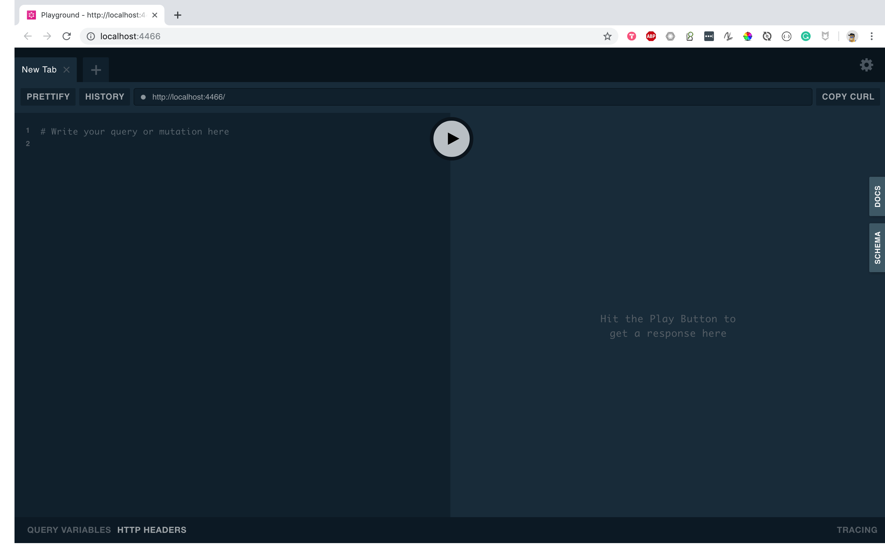
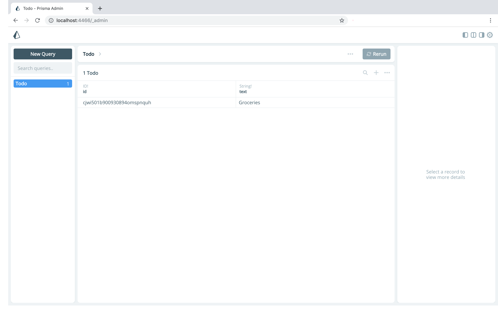

# graphql-go-server

Implement a **TODO-app** as a **CLI tool** using:

- [Golang](https://golang.org/)
- [Prisma](https://prisma.io/)

## Getting Started
Setup and deploy the following: 
- GraphQL Server
- GraphQL Playground
- MySQL Database (free remote AWS provided by [Prisma](https://prisma.io/))

### 1. Download example & install dependencies

Clone the repository in your go env folder (example: `go/src/github.com/` **YOUR SETUP MAY BE DIFFERENT**):

```
git clone https://github.com/flavioespinoza/graphql-go-server.git
```

Ensure dependencies are available and up-to-date:

```
cd graphql-go-server/cli-app
dep ensure -update
```

### 2. Install the Prisma CLI

To run the example, you need the Prisma CLI. Please install it via Homebrew or [using another method](https://www.prisma.io/docs/prisma-cli-and-configuration/using-the-prisma-cli-alx4/#installation):

```
brew install prisma
brew tap
``` 

### 3. Set up database & deploy Prisma datamodel

For this example, you'll use a free _demo database_ (AWS Aurora) hosted in Prisma Cloud. To set up your database, run:

```
prisma deploy
```

Then, follow these steps in the interactive CLI wizard:

1. Select **Demo server**
1. **Authenticate** with Prisma Cloud in your browser (if necessary)
1. Back in your terminal, **confirm all suggested values**


### 3.1 Docker Alternative

<details>

<summary>Run Prisma locally with docker-compose</summary>

- Follow the steps below

1. Ensure you have Docker installed on your machine. 	If not, you can get it from [here](https://store.docker.com/search?offering=community&type=edition):
	```bash
	docker --version
	```

1. CD into the **`cli-app/`** directory and create **`docker-compose.yml`** file:
	```bash
	touch docker-compose.yml
	```

1. Copy the content below add it to the new **`docker-compose.yml`** file:
    ```yml
    version: '3'
    services:
      prisma:
        image: prismagraphql/prisma:1.34
        restart: always
        ports:
        - "4466:4466"
        environment:
          PRISMA_CONFIG: |
            port: 4466
            databases:
              default:
                connector: mysql
                host: mysql
                port: 3306
                user: root
                password: prisma
                migrations: true
      mysql:
        image: mysql:5.7
        restart: always
        environment:
          MYSQL_ROOT_PASSWORD: prisma
        volumes:
          - mysql:/var/lib/mysql
    volumes:
      mysql:
    ```
1. Run with `docker-compose`
	```bash
	docker-compose up -
	```

1. Open the `prisma.yml` located in the `graphql-go-server/cli-app/prisma/` directory and set `endpoint` to `http://localhost:4466`:
	```yaml
	# Specifies the HTTP endpoint of your Prisma API.
	endpoint: http://localhost:4466 
	...
	```

1. Deploy with `prisma`:
	```bash
	prisma deploy
	```

</details>

<!-- You can now use [Prisma Admin](https://www.prisma.io/docs/prisma-admin/overview-el3e/) to view and edit your data by appending `/_admin` to your Prisma endpoint. -->

### 4. Use the CLI app

```
go run main.go
```

#### create <item: string>

Add Todo item
```
go run main.go create 'Lissy Salsa Dancing, Thursday'
```

#### list

List all `Todo` items

```
go run main.go list
```

#### delete <item: string>
Remove a `Todo` item

```
go run main.go delete 'Groceries'
```

## 6. GraphQL Playground
Navigate to: http://localhost:4466/




<!-- - [ ] TODO: Check if admin add can be disabled -->

<!-- ## 7. GraphQL Admin
Navigate to: http://localhost:4466/_admin

 -->

## Next steps

- [Use Prisma with an existing database](https://www.prisma.io/docs/-g003/)
- [Explore the Prisma client API](https://www.prisma.io/client/client-go)
- [Learn more about the GraphQL schema](https://www.prisma.io/blog/graphql-server-basics-the-schema-ac5e2950214e/)